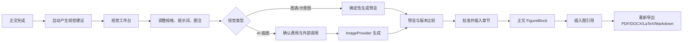

# PaperForge 视觉生成功能流程化优化方案

结论：视觉能力的后端链路基本完整，当前主要问题是前端信息架构错误、页面加载耦合过重、操作入口割裂，以及生成器能力没有被准确反映到界面。应将“图表与插图”从素材中心拆出，升级为所有论文类型都能访问的独立“视觉工作台”。

最新运行记录中 `/assets` 页面和四个相关接口均返回 200，因此目前并非稳定的后端路由故障；“打不开”主要来自综述论文主动隐藏/跳转 assets，以及任一接口失败便拖垮整页的脆弱加载方式。

本文所有现状描述均已对照代码核实，文件行号见各节引用。

## 一、现状问题

### 1. 视觉能力被错误绑定到“原创论文素材”

当前流程明确让综述论文不显示素材中心：[pipeline.ts (line 44)](/Users/zzy/Projects/paper-forge/apps/web/lib/pipeline.ts:44)。

但视觉生成入口又被放在素材中心内部，导致：

- 原创论文能看到“素材中心 → 图表与插图”。
- 综述论文虽然支持视觉建议、AI 生图、审核插入和导出，却没有正常入口。
- 项目切换器从原创项目切换到综述项目时，会主动离开 `/assets`：[project-switcher.tsx (line 90)](/Users/zzy/Projects/paper-forge/apps/web/components/layout/project-switcher.tsx:90)。
- 用户只能手工修改 URL，形成“功能存在但流程里不存在”的状态。

管线阶段名同样没有落到导航上：`STAGE_TO_STEP`（[pipeline.ts (line 88)](/Users/zzy/Projects/paper-forge/apps/web/lib/pipeline.ts:88)）不包含 `visual_plan` 与 `visual_generate`，视觉任务在跑时导航上没有任何一步会亮起。

### 2. assets 页面采用全有或全无加载

[assets-center.tsx (line 60)](/Users/zzy/Projects/paper-forge/apps/web/components/assets/assets-center.tsx:60) 同时请求：

- 原始素材
- NUMLINT
- 视觉资产
- 运行时设置

它们被放在同一个 `Promise.all` 中。任何一个接口发生 401、超时或临时 500，整个素材页面都会显示加载失败，即使其他三个模块完全正常。

写作台更严重：[writing-workbench.tsx (line 129)](/Users/zzy/Projects/paper-forge/apps/web/components/writing/writing-workbench.tsx:129) 一次加载七类数据，`listVisuals` 失败会直接进入整页 `loadError`，正文编辑器一起打不开。

### 3. 操作流程被拆散

| 操作             | 素材中心 | 写作工作台   |
| ---------------- | -------- | ------------ |
| 查看视觉资产     | 有       | 仅看待确认项 |
| 修改提示词/规格  | 有       | 无           |
| 生成预览         | 有       | 有           |
| 修改后生成新版本 | 有       | 无           |
| 批准并插入       | 无       | 有           |
| 插入正文图引用   | 无       | 有           |
| 查看历史版本     | 平铺显示 | 基本没有     |

素材中心侧只有 generate / regenerate / reject / edit（[visuals-gallery.tsx](/Users/zzy/Projects/paper-forge/apps/web/components/assets/visuals-gallery.tsx)），`approveVisual` 只存在于写作台（[writing-workbench.tsx (line 378)](/Users/zzy/Projects/paper-forge/apps/web/components/writing/writing-workbench.tsx:378)）。用户必须在两个页面之间来回切换，且两个卡片组件的行为并不一致。

### 4. 自动建议质量不够

当前 `visual_plan` 是**完全确定性的，一次模型调用都没有**（[visuals.py (line 81)](/Users/zzy/Projects/paper-forge/services/worker/paperforge_worker/pipelines/visuals.py:81)）。AI 插图提示词是标题套模板（[visuals.py (line 158)](/Users/zzy/Projects/paper-forge/services/worker/paperforge_worker/pipelines/visuals.py:158)）：

```
A clean academic conceptual illustration representing {论文标题}...
```

它没有真正理解章节内容、构图目标和论文语境，容易出现：

- 将“投毒攻击”画成毒药袋。
- 生成伪中文或伪英文。
- 用装饰图替代学术信息。
- 英文安全敏感词组合触发 Cloudflare 拒绝。
- 修改正文后，旧建议仍看起来像是最新建议。

需要注意：这一条的改造会**首次给 visual_plan 引入文本模型依赖**，成本与降级路径见 §四.1。

### 5. 界面暴露了提供商不支持的选项

Cloudflare FLUX.1-schnell 当前只实际使用：

- `prompt`
- `steps`

请求体就是 `{"prompt": ..., "steps": steps}`，`size` 只被记进 usage 供事后追溯（[provider.py (line 254)](/Users/zzy/Projects/paper-forge/packages/visuals/visuals/provider.py:254)）。而界面仍提供“横向 3:2 / 方形 1:1 / 竖向 2:3”三选一（[visuals-gallery.tsx (line 421)](/Users/zzy/Projects/paper-forge/apps/web/components/assets/visuals-gallery.tsx:421)）。用户选择“横向 3:2”，却仍可能得到 1024×1024 图片。

这也是未来接入 GPT Image、Gemini、ComfyUI 时必须解决的问题：界面不能假设所有提供商具备相同能力。

### 6. 错误信息缺乏行动指引（分类已存在，但没有暴露到界面）

需要澄清一个常见误解：**错误分类不是零，`error_code` / `error_message` 已经落库并已在 `VisualResponse` 中返回**（[schemas.py (line 361)](/Users/zzy/Projects/paper-forge/services/api/paperforge_api/schemas.py:361)）。现有 code 集合来自 [provider.py](/Users/zzy/Projects/paper-forge/packages/visuals/visuals/provider.py)：

```
auth / moderation / rate_limit / provider_5xx / network
invalid_base64 / image_too_large / invalid_image_type
provider_not_configured / provider_error
```

真正的三个缺陷是：

**(a) 面向用户的文案被压平。** 400/422 无论内容审核还是参数错误，`message` 都是同一句 `Cloudflare image request rejected`——尽管 `code` 已经区分了 `moderation` 与 `invalid_request`。用户看到的是压平后的那一句。

**(b) 非 provider 异常落的是裸类名。** [visuals.py (line 363)](/Users/zzy/Projects/paper-forge/services/worker/paperforge_worker/pipelines/visuals.py:363) 对任何非 `ImageProviderError` 直接写入 `type(error).__name__`。visuald 不可达、chart 源素材解析不唯一、对象存储写失败全部走这条路——而**图表与示意图占建议的大多数**，这才是最高频的失败面。用户看到的是 `ValueError`、`ConnectError` 这类不可行动的字符串。

**(c) request ID 在失败路径上根本不存在。** provider 只在**成功**时读取 `cf-ray`（[provider.py (line 333)](/Users/zzy/Projects/paper-forge/packages/visuals/visuals/provider.py:333)）；异常路径里 `record_visual_attempt` 收到的 `request_id` 恒为 `None`（[visuals.py (line 376)](/Users/zzy/Projects/paper-forge/services/worker/paperforge_worker/pipelines/visuals.py:376)）。要在错误里显示 request ID，必须给 `ImageProviderError` 增加字段——这是 `packages/visuals` 的改动，不是 API 层能补的。

结果是用户看不出是内容检查、参数问题还是 visuald 挂了，也不知道是否应重试，只能反复试提示词。

### 7. 编辑和插图存在并发覆盖风险（且是必然发生，不是偶发）

视觉批准会直接更新服务端 PaperIR。写作台的草稿恢复 effect 以 `active.updated_at` 为依赖，只要服务端行的 `updated_at` 变化且 localStorage 草稿与服务端 JSON 不等，就把草稿回填进编辑器（[writing-workbench.tsx (line 225)](/Users/zzy/Projects/paper-forge/apps/web/components/writing/writing-workbench.tsx:225)）。

于是链路是确定的：

```
批准插图 → approve 写回章节 → reload() → updated_at 变化
→ effect 重跑 → localStorage 里那份「不含 FigureBlock」的草稿被判为未保存修改并回填
→ 下一次保存删掉刚插入的图
```

这不是“可能覆盖”，是必然。因此**仅在 API 上加乐观并发控制解决不了**——前端必须在批准成功后重置或清除该章节的 `draftKey`，见 §五.3。

### 8. 视觉任务与全文任务共用单槽进度追踪

`useJobTracker` 只持有一个 `tracked`，且挂载恢复时取 `data.find(j => !TERMINAL.has(j.status))`——第一个非终态任务（[useJobTracker.ts](/Users/zzy/Projects/paper-forge/apps/web/lib/useJobTracker.ts)）。同时存在全文任务与视觉任务时，界面追踪哪一个是不确定的，后启动的会覆盖前一个。

另外 `_STAGE_PROGRESS` 里 `visual_generate = 0.75` 小于 `visual_plan = 0.95`（[worker.py (line 60)](/Users/zzy/Projects/paper-forge/services/worker/paperforge_worker/worker.py:60)）。独立的生图任务会长期停在 75%，然后直接跳到完成。

### 9. 前端没有任何自动化测试

`apps/web` 当前无 vitest / playwright / testing-library 依赖，无 `test` script，无 `*.test.*` 文件。本方案 P0 的验收标准（“任一辅助接口失败仍能打开”）恰好是最适合单测的一类断言，因此测试基建不能压到最后（见 §七）。

------

## 二、目标流程

````

````

流程原则：

- 视觉是正文完成后的独立可选阶段。
- 不阻断 draft-first 全文生成。
- 自动建议不调用付费生图。
- 未处理视觉建议不阻止导出，但导出中心明确提醒“这些建议未包含”。
- 图表、示意图和 AI 插图使用同一个审核、版本和插入流程。

------

## 三、前端信息架构改造

### 1. 新增独立“视觉工作台”

新增通用路由：

```
/projects/{project_id}/visuals
```

两类论文的流程调整为：

```
综述论文：
概览 → 研究范围 → 文献工作台 → 大纲 → 写作 → 视觉 → 导出

原创论文：
概览 → 素材 → 研究范围 → 文献工作台 → 大纲 → 写作 → 视觉 → 导出
```

其中：

- `/assets` 只负责原始数据、结果表格、方法笔记和 NUMLINT。
- `/visuals` 负责上传成品图片、生成图表、生成示意图、AI 插图、审核和版本管理。
- 原创论文原来的“图表与插图”页签改为指向视觉工作台的入口，避免旧用户迷失。

需要同时处理的两条旧路径：

- `/projects/{id}/assets`：综述论文访问时跳转到 `/visuals`。
- 扁平旧路由 [app/assets/page.tsx](/Users/zzy/Projects/paper-forge/apps/web/app/assets/page.tsx)（`/assets?project=...`）：先解析到项目，再按 paper_type 决定落到 `assets` 还是 `visuals`。

`project-switcher.tsx:90` 的 `paper_type !== 'original'` 特判应当**删除**，而不是扩展成三分支——视觉步骤对两类论文都存在后，这个特判失去了存在理由。

同时扩展管线状态映射：

- 新增 `PipelineStepId` 成员 `visuals`，并加入 `REVIEW_FLOW` 与 `ORIGINAL_FLOW`。
- `STAGE_TO_STEP` 增加 `visual_plan → visuals`、`visual_generate → visuals`。

导航上显示待处理数量、生成中状态和失败告警。

### 2. 视觉工作台采用统一三栏结构

- 左侧：状态和类型筛选。
  - 待处理
  - 生成中
  - 可批准
  - 已插入
  - 失败
  - 已拒绝
- 中间：视觉卡片和版本组。
- 右侧抽屉：编辑规格、预览、来源、图注、插入位置和生成记录。

同一张卡片必须完整提供：

- 调整
- 生成/重试
- 创建新版本
- 版本比较
- 批准并插入
- 拒绝
- 下载 PNG/SVG/PDF
- 查看来源和生成记录

历史版本按同一条 lineage 折叠，默认只显示最新版和当前已批准版，避免 v1、v2、v3 平铺占满页面。lineage 已有后端基础：`regenerate` 会创建 `version = old.version + 1`、`supersedes_id = old.id` 的新行（[visuals.py router (line 313)](/Users/zzy/Projects/paper-forge/services/api/paperforge_api/routers/visuals.py:313)），前端按 `supersedes_id` 链回溯即可，无需新增字段。

### 3. 写作台保留轻量入口

写作台不再维护另一套视觉业务组件，只显示：

- 待处理视觉数量。
- 当前章节建议。
- “打开视觉工作台”。
- 共用的视觉编辑抽屉。
- 已批准图片的替换、删除和图引用操作。

用户在写作台点击“调整”时直接打开共用编辑器，不再被迫跳转素材中心。

### 4. 拆分页面加载状态

所有页面改为模块独立加载：

- 原始素材失败不影响视觉列表。
- 设置接口失败时只禁用 AI 按钮，确定性图表仍可用。
- NUMLINT 失败只显示局部告警。
- 视觉列表失败不能导致正文编辑器消失。
- 图片 rendition 失败只影响对应卡片。

实现上使用独立请求状态或 `Promise.allSettled`，并增加：

- 路由级错误边界。
- 模块级重试按钮。
- 项目切换时取消旧请求。
- 延迟加载：只有创建数据图表时才请求原始表格素材。
- 只有打开“批准插入”面板时才加载章节列表。

------

## 四、视觉建议与生成质量

### 1. 将建议从“标题套模板”升级为结构化规划

视觉规划器读取当前 PaperIR，输出经过验证的结构：

```
{
  "kind": "diagram",
  "reason": "引言包含攻击数据进入模型并影响排序的连续过程",
  "source_section_keys": ["introduction"],
  "target_section_key": "introduction",
  "suggested_block_index": 4,
  "caption": "...",
  "alt_text": "...",
  "spec": {}
}
```

规划策略：

- 结果数据存在时优先建议确定性图表。
- 存在明确步骤、组件或关系时建议结构化示意图。
- 只有无法通过节点/边准确表达、且确实需要概念氛围时才建议 AI 插图。
- 每次最多 6 条，AI 插图最多 2 条。
- 建议阶段始终不调用 ImageProvider。

**新增的模型依赖必须显式定案。** 当前 `suggest_visuals` 无任何模型调用；本改造让 `visual_plan` 成为一个新的文本模型消费者，落地前需要确定：

- 使用哪个 role（建议复用 `planner`：结构化 JSON + 已有确定性回退惯例）。
- 计费口径：调用必须记入 `llm_call_log`，否则项目成本面板会漏掉这一段。
- 降级路径：文本模型不可用、超时或 JSON 校验失败时，回退到现有确定性规划器（保留 [visuals.py (line 93-184)](/Users/zzy/Projects/paper-forge/services/worker/paperforge_worker/pipelines/visuals.py:93) 的整条逻辑，不删除）。
- 上下文预算：只送章节标题与摘要级文本，不整篇灌入。

新增建议上下文字段：

- `suggestion_reason`
- `source_section_keys`
- `paper_snapshot_hash`

正文变化后，如果快照哈希不同，卡片显示“建议基于旧版正文”，允许重新分析或继续使用，不自动删除旧资产。

### 2. AI 提示词分为语义层和提供商层

业务层保存提供商无关的语义描述，例如：

```
{
  "subject": "sequential recommendation robustness",
  "composition": "left-to-right conceptual process",
  "elements": ["normal interactions", "anomalous interactions", "model", "changed ranking"],
  "style": "academic flat vector",
  "text_policy": "none",
  "aspect_ratio": "3:2"
}
```

各 ImageProvider 适配器负责转换为厂商请求：

- Cloudflare：短英文 prompt + 4/6/8 steps。
- GPT Image：尺寸、质量和输出格式。
- Gemini：对应比例和生成配置。
- ComfyUI：转换成工作流输入。

这样未来新增提供商不需要修改视觉工作台、PaperIR 或审核流程。

**兼容约束（不可忽略）：**

- `AIImageSpec` 是 `StrictModel`（[specs.py (line 159)](/Users/zzy/Projects/paper-forge/packages/visuals/visuals/specs.py:159)），新增字段必须为可选并保留 `prompt`，否则历史 `spec_json` 行直接 validate 失败。
- `input_hash = visual_input_hash(spec_json)` 被用于跳过重复建议（[visuals.py (line 190)](/Users/zzy/Projects/paper-forge/services/worker/paperforge_worker/pipelines/visuals.py:190)）。spec 结构一变，同一张图的哈希也变，下一次 `visual_plan` 会把已有建议**再提一遍**。迁移方案二选一：
  1. 哈希只对语义关键字段的规范化投影求值，忽略新增可选字段；或
  2. 迁移时按新算法回填历史行的 `input_hash`。
- 语义字段同样要通过现有的 `conceptual_only` 校验（禁 URL、禁量化表述），校验器需要覆盖新字段而不只是 `prompt` / `style`。

### 3. 增加提供商能力声明

统一能力接口：

```
interface ImageProviderCapabilities {
  supportedSizes: string[];
  supportedAspectRatios: string[];
  qualityModes: string[];
  promptMaxLength: number;
  supportsNegativePrompt: boolean;
  supportsSeed: boolean;
  fixedOutputSize?: string;
  costEstimateAvailable: boolean;
}
```

设置接口只返回能力和配置状态，不返回 Token、Account ID 或 Base URL（现有 `/settings` 已遵循“密钥永不回传”，本次只是扩展能力字段）。

Cloudflare FLUX.1-schnell 首版显示：

- 输出尺寸：固定方形或“提供商决定”。
- 质量：低/中/高，对应 4/6/8 步。
- 不再把横向 3:2 描述为一定生效。
- 预览完成后显示实际输出尺寸（`record_visual_attempt` 已存 `output_width` / `output_height`，只需在 `VisualResponse` 暴露）。

### 4. AI 生成前确认

点击 AI“生成预览”时弹出确认框，显示：

- 提供商和模型。
- 将发送的最终提示词。
- 预计质量/步数。
- 可能产生外部费用。
- **不会把论文原文、数据表或上传文件发送给图像服务商。**
- 是否可能无法准确生成文字。

措辞注意：§四.1 之后，正文摘要**确实会**发送给文本模型用于规划。确认框不能笼统写“不会发送论文原文”，必须限定为“不发送给图像服务商”，否则构成误导。规划阶段的数据流向应在设置页或帮助文案中单独说明。

确认后才创建任务，自动建议和重新分析不得绕过确认。

------

## 五、API 与状态契约

保留现有 REST 接口，新增以下兼容字段和接口。

### 1. 视觉摘要

```
GET /projects/{id}/visuals/summary
```

返回：

```
{
  "pending": 2,
  "generating": 1,
  "ready": 1,
  "approved": 3,
  "failed": 0
}
```

用于导航状态、项目概览和导出提醒，避免为一个状态点加载完整视觉列表。

**`stale` 字段不在首版。** 它依赖 §四.1 的 `paper_snapshot_hash`，而快照字段排在 P2。首版 summary 只返回上述五个可由现有列存字段直接聚合的计数；`stale` 随 P2 一起补上，届时对 summary 是纯新增字段，前端按可选处理。

### 2. 结构化错误

`VisualResponse` 增加嵌套 `error` 对象，与现有平铺的 `error_code` / `error_message` **并存一个版本**，前端切换完成后再废弃平铺字段：

```
{
  "error": {
    "code": "content_rejected",
    "message": "提示词可能触发了图像服务的内容检查，请调整描述后重试。",
    "retryable": false,
    "request_id": "..."
  }
}
```

统一错误分类（左为新 code，右为现有落库值，迁移时按此映射）：

| 新 code                    | 现有 `visual.error_code`                        |
| -------------------------- | ----------------------------------------------- |
| `provider_not_configured`  | `provider_not_configured`、`visuals_disabled`、`ai_images_disabled` |
| `authentication_failed`    | `auth`                                          |
| `content_rejected`         | `moderation`                                    |
| `invalid_request`          | `invalid_request`                               |
| `rate_limited`             | `rate_limit`                                    |
| `provider_unavailable`     | `provider_5xx`、`provider_error`                |
| `network_timeout`          | `network`                                       |
| `invalid_image`            | `invalid_base64`、`image_too_large`、`invalid_image_type` |
| `normalization_failed`     | （新增，visuald 归一化失败）                     |
| `visuald_unavailable`      | （新增，见下）                                   |
| `source_unresolved`        | （新增，见下）                                   |
| `internal_error`           | （新增，兜底）                                   |

后三类是原分类表遗漏的最高频失败面。[visuals.py (line 363)](/Users/zzy/Projects/paper-forge/services/worker/paperforge_worker/pipelines/visuals.py:363) 目前对任何非 `ImageProviderError` 直接写 `type(error).__name__`，而图表与示意图的失败（visuald 连接失败、chart 源素材解析不唯一、对象存储写失败）全部走这条路。落地要求：

- 在 worker 的 except 分支加一层显式映射，**不再允许裸类名进入 `error_code`**。
- 未识别异常统一落 `internal_error`，同时把原始类名写进脱敏后的 `error_message`。
- 迁移期间读侧对历史裸类名做兼容映射，界面显示为 `internal_error`。

request ID 需要 `packages/visuals` 配合改造：`ImageProviderError` 增加 `request_id` 字段，Cloudflare/OpenAI 适配器在抛错前从响应头读取 `cf-ray` / `x-request-id` 并带上。目前只有成功路径读取，失败路径恒为 `None`。

后端保存经过脱敏的 HTTP 状态、request ID 和错误摘要，不保存 Token，也不把厂商原始响应直接返回浏览器。

### 3. 并发安全插入

批准接口增加章节版本条件（`SectionResponse` 已返回 `updated_at`，无需新增读侧字段）：

```
{
  "section_key": "introduction",
  "block_index": 4,
  "expected_section_updated_at": "..."
}
```

章节保存接口也提交基础版本。若服务端章节已经变化，返回：

```
{
  "detail": {
    "code": "section_changed",
    "message": "章节已在其他位置更新，请合并后重试。"
  }
}
```

写作台批准视觉时：

1. 检测当前章节是否有未保存草稿。
2. 先保存草稿。
3. 使用最新章节版本批准插图。
4. **用批准后的服务端 IR 重写该章节的 localStorage `draftKey`（或直接删除该 key）。**
5. 更新编辑器并定位到新 FigureBlock。

第 4 步不可省略，是 §一.7 的直接修复：草稿恢复 effect 以 `updated_at` 为依赖，approve 后的 `reload()` 必然触发它，若 localStorage 里仍是旧草稿，编辑器会被回填成不含 FigureBlock 的版本，下一次保存即删图。乐观并发控制只挡住服务端竞态，挡不住这条本地路径。

同理，写作台 approve 成功后当前的 `setEditorRevision(r => r + 1)` 强制重挂载（[writing-workbench.tsx (line 384)](/Users/zzy/Projects/paper-forge/apps/web/components/writing/writing-workbench.tsx:384)）必须排在草稿重写之后，否则重挂载读到的仍是旧草稿。

### 4. 视觉任务独立追踪

视觉任务不再覆盖项目级全文任务：

- 使用 `visual_id → job_id` 的卡片级任务映射。
- 每张卡片独立显示排队、生成、规范化和完成。
- SSE 继续保留现有轮询校准兜底（`lib/api.ts` 中尚未提交的改动）。
- 同一项目最多并行一个 AI 生图任务，防止误触造成重复费用。
- 确定性图表/示意图最多并行两个。
- 页面切换后任务状态可恢复。

**这是 P1 中工作量最大的一项，需要单独排期。** `useJobTracker` 当前是单槽结构：只持有一个 `tracked`，恢复时取第一个非终态任务。改成多任务映射要动 hook 本身，而它被四个工作台与 `job-progress-card` 共用。实施拆成两步：

1. 把 `useJobTracker` 内部改为 `Map<jobId, TrackedJob>`，对外先保留 `tracked`（= 当前主任务）的兼容读法，四处调用点不动。
2. 视觉工作台改用新的按 id 读取接口；`job-progress-card` 支持渲染多条。

同时修正 `_STAGE_PROGRESS`：`visual_generate = 0.75` 小于 `visual_plan = 0.95`（[worker.py (line 60)](/Users/zzy/Projects/paper-forge/services/worker/paperforge_worker/worker.py:60)），独立生图任务会长期停在 75% 再跳到完成。视觉阶段的进度权重应按任务种类归一化，而不是复用全文管线的绝对刻度。

------

## 六、编辑器与导出闭环

### 1. Figure NodeView 升级

将当前只读原子 FigureBlock 改为专用 React NodeView（`@tiptap/react` 已在依赖中），显示：

- 真实图片预览。
- 图注与 alt text。
- AI 来源标识。
- 单栏/通栏宽度。
- 调整图注。
- 替换为新版本。
- 删除图片。
- 复制/插入图引用。

视觉列表刷新后 NodeView 的 rendition 映射必须同步更新，不能依赖重新挂载整个编辑器。

### 2. 图引用显示真实编号

编辑器根据全文 PaperIR 顺序建立：

```
fig:va_xxx → 图 1
fig:va_yyy → 图 2
```

图引用芯片显示“图 1”，悬停时显示 label 和图注；保存时仍只保存稳定 label，避免编号写死。

### 3. 导出状态提示

导出中心增加视觉摘要：

- 已插入 3 张。
- 2 条建议尚未处理，本次导出不会包含。
- 1 张生成失败。
- 当前导出产物早于最近一次图片插入，需要重新导出。

视觉不作为硬门槛：

- 用户可以忽略所有建议并导出纯文本论文。
- 已批准图片必须完整进入 PDF、DOCX、LaTeX ZIP 和 Markdown Bundle。
- 新视觉批准后，旧导出标记为“内容已更新”，但不会自动产生费用或自动重新编译。

------

## 七、实施顺序

### P0：稳定性修复与测试基建

- 将综述论文的视觉入口加入导航。
- 将 assets 和写作台的 `Promise.all` 拆成独立加载。
- 在写作台视觉卡片增加“调整”入口。
- 保留当前尚未提交的 SSE 轮询校准改动，不覆盖用户现有修改。
- 保存脱敏错误分类并提供可执行提示；**先消灭裸异常类名**（§五.2 的 `internal_error` 兜底），这一步不依赖新 code 表。
- 搭建 Vitest + React Testing Library 最小基建：配置、jsdom 环境、`lib/api.ts` 的 mock 层、`pnpm test` script、CI 接线。

验收：任何一个辅助接口失败时，素材页和正文页仍能打开，并有对应单测覆盖该断言。

> 测试基建放在 P0 而非 P3：`apps/web` 目前零测试，而 P0 的验收标准本身就是最典型的单测断言。若推迟到最后，P0–P2 全部只能靠手工回归。Playwright 端到端仍留在 P3。

### P1：视觉工作台

- 新增 `/projects/{id}/visuals`，并处理两条旧路径跳转、删除 project-switcher 特判。
- 将视觉卡片、编辑器和操作逻辑收敛成共用组件。
- `/assets` 回归原始素材职责。
- 加入版本折叠（按 `supersedes_id` 链）、筛选和批准插入。
- 增加视觉摘要接口（不含 `stale`）与导航状态。
- `useJobTracker` 多任务化（分两步，见 §五.4）与 `_STAGE_PROGRESS` 修正。

验收：综述和原创论文都能从正常导航完成“调整—生成—批准—插入”；全文任务与视觉任务并行时进度互不覆盖。

### P2：规划与提供商能力

- 实现结构化 Visual Planner，含 role 归属、`llm_call_log` 计费与确定性回退。
- 加入 `paper_snapshot_hash`、过期提示，并给 summary 补 `stale`。
- spec 语义层扩展与 `input_hash` 迁移（§四.2）。
- 增加 ImageProvider 能力声明。
- Cloudflare UI 只显示真正支持的选项。
- 增加最终提示词预览、费用确认和实际输出尺寸。
- `ImageProviderError` 携带 request_id；完成新旧 error code 映射与读侧兼容。

验收：替换或新增 provider 时，核心工作流和页面不需要增加厂商分支；spec 迁移后不产生重复建议。

### P3：编辑器与导出体验

- Figure React NodeView。
- 图引用确定性编号。
- 章节乐观并发控制 + 批准后草稿重写（§五.3 第 4 步）。
- 导出过期检测和视觉完整性摘要。
- 补齐 Playwright 端到端视觉 QA。

验收：未保存草稿不会覆盖刚插入的图，所有导出格式与正文预览一致。

------

## 八、测试与验收

前端测试基建（Vitest + RTL）随 P0 落地，Playwright 随 P3 落地。重点覆盖：

- 综述项目正常显示“视觉”步骤。
- 原创项目同时显示“素材”和“视觉”。
- 旧综述 `/projects/{id}/assets` 与扁平 `/assets?project=` 均正确跳转。
- assets、NUMLINT、settings、visuals 任一请求失败时，其余区域仍可用。
- 写作台能够修改 AI 提示词并生成新版本。
- AI 生成必须经过显式确认。
- 自动分析全文不会调用 ImageProvider。
- Cloudflare 不显示不支持的尺寸承诺。
- 400、401、429、5xx、超时和内容拒绝显示不同操作建议。
- visuald 不可达时显示 `visuald_unavailable` 而非裸异常类名。
- 同时运行全文任务和视觉任务时进度不互相覆盖。
- 章节有未保存草稿时，批准插图不会造成内容丢失；批准后 localStorage 草稿已按新 IR 重写。
- 新版图片批准前不替换正文中的旧版。
- spec 语义层迁移后，`visual_plan` 不会对已有建议重复提案。
- FigureBlock/XRefRun 编辑往返无损。
- PDF、DOCX、LaTeX ZIP、Markdown Bundle 均包含批准图片。
- 视觉服务或图片提供商不可用时，正文编辑和无图导出仍然成功。

最终产品验收路径：

```
全文生成完成
→ 自动出现视觉建议
→ 在写作台直接调整描述
→ 确认调用 Cloudflare
→ 查看预览和实际尺寸
→ 批准插入指定章节
→ 正文立即显示图片
→ 插入“图 1”引用
→ 导出中心提示重新导出
→ PDF/DOCX/LaTeX/Markdown 均包含该图
```

兼容策略：现有 `visual_asset`、`va_*`、FigureBlock、已批准版本和对象存储路径全部保留；新增字段使用可空迁移，旧版本自动归入各自的版本组，不要求重新生成。两处需要显式迁移动作而非纯新增：

1. `visual.error_code` 的旧值按 §五.2 映射表转换，或在读侧做兼容映射。
2. `input_hash` 按 §四.2 的两种方案之一处理，避免建议重复。
