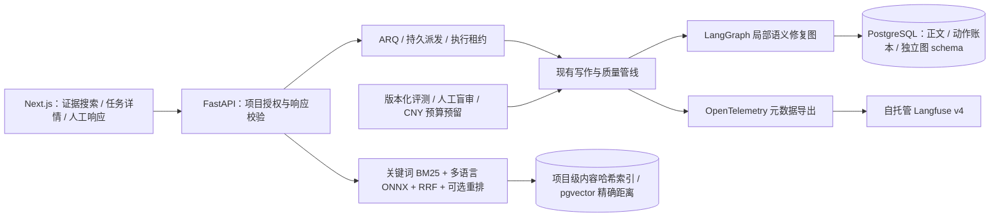

# PaperForge Agent 平台升级（2026-09-18）

这是当前能力说明；之前的架构审计、写作升级和部署报告保留为各自时点的历史记录。
工程上线与科研质量验收分别记录，见 [本次验收](acceptance/agent-platform-20260918.md)。新框架、成功部署和测试数量均不代表质量提升实验通过。

## 架构与已实现能力



- `SEMANTIC_REPAIR_ENGINE=langgraph` 仅改变新任务的语义修复子流程。旧任务或缺失引擎字段的续跑保持 legacy。ARQ、共享配额、最终质量门与模型选择继续复用。
- 图状态在独立 `paperforge_graph` schema，由官方 PostgreSQL checkpointer 管理；Worker 启动时用 advisory lock 串行初始化。Alembic 只管理 public 业务表。
- 图节点为评审、选路、执行、准备人工输入、人工响应和结束。图状态不保存全文。动作账本先于副作用写 started；恢复遇到不明确动作先重新核查，不盲目重放。不承诺外部请求 exactly-once。
- 达到修复上限或没有新路线时暂停并释放 ARQ 槽位。补材料后可复评，轮数及调用预算不重置；“结束修复”不绕过最终质量门。
- 人工响应绑定中断 ID、图版本、文档及正文快照。陈旧响应、重复响应和人工改稿冲突返回 409；该情况下对当前稿件重新发起质量修复。
- `GET /projects/{id}/jobs/{jid}/trace` 按项目授权，跨续跑链汇总调用、已知费用、未知用量与节点事件，不返回 prompt。最多展示 1000 条事件/调用，截断明确标记；费用汇总涵盖全部账本记录。

## 检索与模型边界

`GET /projects/{id}/evidence/search?q=...&mode=hybrid_rerank` 查询入选、未撤稿且当前项目可见的 Evidence。支持 lexical、vector、hybrid、hybrid_rerank 四种模式。默认每路 40 条，RRF 合并前 40 条，返回 12 条。结果保留 Evidence ID、来源文件、页码、字符范围、全文内容哈希和证据等级；相关性不是蕴含验证。

关键词使用 BM25 评分，英文词元与中文二元组。向量使用 FastEmbed 0.8.0 的多语言 MiniLM（384 维、mean pooling）；模型内部 512 token 上限会影响长证据召回，需在实际领域评测中检查。小型重排模型是英文 MiniLM，中文/混合文本明确退回 RRF；没有伪称实现中文神经重排。

`POST /projects/{id}/evidence/index` 启动可追踪的本地索引任务。按项目、模型和实际内容哈希增量更新，每批检查停止信号，提交检查执行租约。变更或已移出权限范围的材料不得提交。索引失败不修改正文；无索引/模型不可用时保留关键词结果。单项目当前上限 10000 条，搜索返回截断标记、索引超限明确失败。

迁移 `0034_evidence_embedding` 使用 PostgreSQL 数组存储向量，以兼容尚未安装扩展的服务器。安装 pgvector 后查询直接用 `embedding::vector <=> query::vector` 精确距离；未安装时使用显式标记的本地精确距离后端。不需要 HNSW 索引，不伪称已通过大规模 ANN 容量验证。

`EVIDENCE_RETRIEVAL_MODE=hybrid`/`hybrid_rerank` 可用于新任务的证据矩阵候选排序，保留任务匹配、文献多样性、可比性及原分类器。默认 legacy，等待人工相关性评测后再改变自动生成默认；用户可直接使用新的证据搜索界面。

## 观测与部署

OTLP 默认关闭；开启后只导出允许的元数据、哈希、用量和计价值。SDK 异步批处理，有界队列；Collector 不可用不阻断生成。业务状态、费用和预算的事实源仍为 PostgreSQL。提示词原文不会额外进入 Langfuse。

独立部署文件为 `infra/docker-compose.langfuse.yml`，包含专用 PostgreSQL、Redis、ClickHouse 和 MinIO，Web 仅绑定 `127.0.0.1:3300`。敏感配置位于权限受限的 `.paperforge/langfuse.env`，通过 SSH 转发访问管理界面。遥测发送和开放注册默认关闭。Langfuse v4 读取使用 `/api/public/v2/observations`，不能使用已停用的 v1 traces API。

```bash
./scripts/agent-observability init --network paperforge-prod_core
./scripts/agent-observability up
./scripts/dev restart
```

必须通过新部署健康检查、Funnel 目标和公开 `/login` 字节一致性检查。保留旧部署在途任务；独立观测服务不参与业务蓝绿切换。

pgvector 镜像构建见 `infra/postgres-vector.Dockerfile`。当前宿主可在不重启数据库的情况下安装匹配版本扩展文件，再执行 `CREATE EXTENSION vector`。后续重建共享数据库必须使用带扩展镜像（`PAPERFORGE_POSTGRES_IMAGE`），不要只依赖容器可写层。业务数组数据在缺失扩展时仍可读取。

回退新能力：对新任务设置两个模式为 legacy、关闭 OTLP/Embedding 后蓝绿发布；已开始的图任务继续由保留的新版本 Worker 完成，不把它们交给旧二进制，不删除新增表或图 schema。

## 实验与人工评审

新增实验位于 `evals/agent_upgrade/`。`prepare` 从独立 `_eval` 数据库的三个主题各导出 20 条真实论断—证据候选。前两主题为开发集，第三主题保留测试。标签、评审者和理由留空，机器历史判定不进入盲审包。需人工检查数字、角色、定位、含糊证据及跨节结论类别覆盖；这些候选目前不是人工金标。

`report` 将未标注、未评估、误接纳和误拒绝分开统计；不存在人工金标时 accuracy 为 null，绝不默认通过。

`retrieval` 对现有方案、关键词、向量、融合和重排五臂回放，当前只用原矩阵链接做 proxy Recall/nDCG。链接来自旧分类器且不完整，结果只用于发现性能和召回差异，不证明人工相关性或全稿质量提升。

新增付费实验必须显式提供 `--live --budget-file ... --price-currency CNY`。SQLite `BEGIN IMMEDIATE` 在并发进程间预留费用，累计上限 500 元，分阶段为 50/100/250/100 元。按照已配置模型价格、保守 token 上界和 HTTP 重试次数预留；未知价格拒绝调用，未确认费用不返还预算。该机制约束配置价格下的调用准入，不冒充供应商账单对账。

```bash
PAPERFORGE_EVAL_DATABASE_URL=postgresql+asyncpg://.../paperforge_upgrade_eval \
  uv run python -m evals.agent_upgrade.prepare \
  --project-id UUID1 --project-id UUID2 --project-id UUID3 --output PRIVATE_NEW_DIRECTORY
uv run python -m evals.agent_upgrade.report --cases PRIVATE_NEW_DIRECTORY/cases.json
uv run python -m evals.evaluator_trust.run --live \
  --budget-file .paperforge/agent-upgrade-20260918/budget.sqlite --price-currency CNY \
  --output PRIVATE_NEW_REPLAY_DIRECTORY
```

写作对照继续沿用 `evals.agent_writing.run --protocol frames-v2` 的原门槛，新增上述费用参数；不修改历史实验结果或放宽门槛。真实模型只在隔离评估库写入新稿件，测试夹具只能使用专用 `_test` 库。

## 展示与可用表述

演示顺序：证据页面输入论断 → 查看原文和定位 → 任务详情解释调用与等待 → 查看需补材料的修复暂停 → 提交选择并续跑 → 查看最终质量报告与导出。

可以表述：“为科研写作 Agent 实现 LangGraph 局部修复子图、PostgreSQL 持久化与人工响应，结合项目隔离的混合检索和 OpenTelemetry/Langfuse，建立覆盖恢复、成本及质量评测的工程闭环。”

只有人工评审完成、原实验门槛通过后，才填写质量提升或稳定提速比例。不能把受控浏览器演示、合成故障测试、proxy retrieval labels 或 12 个定向 AI 案例描述为真实用户规模、人工质量认证或通用准确率。
