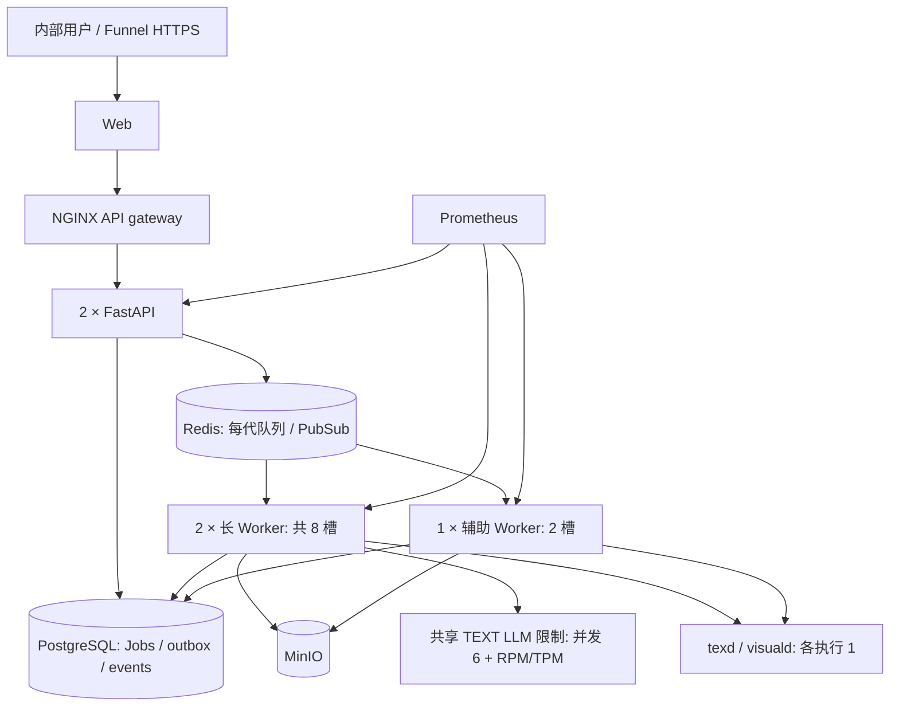

# PaperForge 内部生产容量审阅（2026-09-16）

## 明确结论

**目前不能有依据地宣称已经支持 100 名内部用户正常使用。** 原部署的单 Worker、进程内 LLM 限制、提交事务与入队顺序、缺乏持久执行归属，以及未验证的供应商配额，使这一承诺缺少支撑。本次已补齐一批关键工程机制，并在隔离、资源受限环境验证了 30 个活跃客户端、100 条 SSE 和 8 个并行基础设施测试任务。真实 Agent 的执行时长、供应商 RPM/TPM、图像配额、成本和持续负载仍未验证。

目标是 **100 个账户、20–30 人活跃、每天 30–50 个长任务、瞬时 10 次提交**；不是 100 个并行 Agent。常态排队 p95 ≤10 分钟是待验证目标，突发单独统计。用户未授权付费真实 LLM 压测，本次没有执行此类测试。

## 真实代码审阅与实施

| 环节 | 原有风险与本次处理 | 剩余边界 |
|---|---|---|
| FastAPI/事务 | Job 与 `job_dispatch` 意图同事务提交；依赖使用 function scope，在发送响应前提交，消除跨副本 SSE 首次读取 404；双 API | 未测试所有产品路径的公网持续流量；大文献库规模另测 |
| ARQ/Redis | PostgreSQL outbox、确定性 ARQ ID、每代队列归属、投递失败保留并轮询补投；长队列 8 槽、辅助队列 2 槽 | Redis 数据库按部署隔离，但仍共享同一进程和故障域；辅助 PDF 任务不保证短 |
| 公平性 | 短 PostgreSQL advisory transaction lock 串行化准入/投递；每用户最多 3 个活跃任务，每用户最多 1 个已准入执行，按最近调度时间公平选择；全局待排队上限 100 | 短锁不是长任务全局锁；尚无按部门权重、每日费用硬配额；无需现在引入复杂调度平台 |
| Worker/恢复 | 两个长 Worker，各 4 槽；一个辅助 Worker 2 槽；持久执行 token、120 秒租约、20 秒续约、写事务提交前 fencing；失联先撤销 token 再更新任务状态 | **保守暂停、显式恢复**，不盲目自动重放全部阶段。ARQ `max_tries=3` 不等于业务所有失败自动重试；默认超时 3600 秒，write/rebuild/polish/quality-repair/full 覆盖为 7200 秒。不能保证外部 LLM/对象写入恰好一次 |
| PostgreSQL | API 每副本 pool 2 + overflow 4；Worker 每副本 2 + 6；部署前计算旧连接、36 个新连接、维护与旧任务余量 | 现库 max_connections=100；多代遗留池会积累，不能简单不断扩容；只清理确认已排空的旧代 |
| LLM | 同账户 TEXT HTTP 请求使用 Redis DB0 跨进程并发闸门，默认 6；账户与模型的 RPM/TPM 原子预算，可配置；HTTP 调用线程持有租约至退出 | 配额为 0 表示未配置/未知，绝非供应商无限额。保守 token 预留不等于实际计费 token；图像调用尚无同等完整配额验证，旧代代码也未必经过新闸门 |
| SSE | PostgreSQL 事件为持久事实，Redis PubSub 仅唤醒；短 DB 会话；跨副本准入全局 120、每用户 6；已有流 Redis 续约异常时继续 DB 重放 | 准入作用于当前代 Redis；长达数小时断线/重连和代理切换尚需 soak 验证 |
| 对象/文件 | 生产 MinIO 私有桶；修复并发建桶竞态；上传读取上限、同步存储调用转线程；上传同时全局 4、每用户 2 | 初次并发测试确实发现 7/10 任务因建桶竞态失败，修复后重跑通过。大 PDF、满盘、MinIO 故障尚未完整注入 |
| texd/visuald | 每容器 1 CPU/1 GiB，执行并发 1，body 上限 96 MiB；过载快速 503，客户端在原超时预算内带抖动重试 | 渲染排队会成为批量导出瓶颈；10 请求测试不是任意大文档/任意图表保证；扩大副本前先量测 |
| 隔离/权限 | 沿用 session/owner 权限；注册新增精确邮箱 allowlist；生产默认关闭名单外新注册，原有账号登录保留；对象不公开 | 空名单意味着新注册关闭，需要运维配置获准邮箱。不是完整渗透测试/租户安全认证；公开入口仍需密码/邮箱运维策略 |
| 监控/告警 | API 与 Worker Prometheus 指标，队列等待、最老任务、HTTP、事件与已有结构化日志；独立 Prometheus、7 天/1 GB；4 条告警规则 | 未接入外部告警通知接收器，没有值班响应演练或完整日志集中保留；不能宣称已达到完整内部生产运维标准 |
| 存储/故障域 | PostgreSQL、Redis AOF、MinIO 均集中单机；备份恢复演练使用隔离数据库与桶 | 公共 Redis 审阅时 maxmemory=0、noeviction；测试 Redis 有 512 MiB 上限。生产仍需持久化内存预算配置、磁盘/备份告警；不是 HA |

主要代码：`services/api/paperforge_api/dispatch.py`、`services/worker/paperforge_worker/execution.py`、`packages/llm_runtime/llm_runtime/limits.py`、`packages/db/db/repositories/job_recovery.py`。新增迁移 `0030_job_dispatch` 为加表迁移，保留旧任务兼容路径。旧代尚有任务时保留容器及 Redis 库，不因本次部署停止旧任务。

公共部署已更新为 `paperforge-deploy-20260916-202356`，迁移版本 `0030_job_dispatch`；Funnel 目标及公网 `/login` 逐字节比对通过，公网 API 返回 `durable-v1`，双 API 与三个 Worker 的 Prometheus 抓取均为 up。旧部署保留。部署后观测 PostgreSQL 44 个连接（瞬时快照，不是峰值）。

执行状态与事件以 PostgreSQL 为准；Worker 内仍有阶段并发 semaphore、HTTP 缓存等进程内状态，它们不能充当全局配额。不同阶段会产生多条并行数据库操作，真实卡片提取/证据矩阵负载尚需测池等待；不能把 8 个短 fixture 的成功等同于 8 个完整 Agent 的数据库压力。texd/visuald 的并发上限是每进程的，增加副本时必须同时重算总资源预算。

## 拓扑与资源起点

单机建议以 **16 vCPU / 32 GiB RAM、SSD/NVMe、足够磁盘和异机备份**为起点，保留系统、缓存和蓝绿重叠余量；这是部署建议，不是测得的最低配置。当前公共宿主约 64 逻辑 CPU / 62 GiB，但同时承载很多旧部署，不应把整机资源都计为 PaperForge 可用资源。

| 组件 | 数量与建议资源 |
|---|---|
| API | 2 × 1 CPU / 1 GiB |
| 长 Worker | 2 × 2 CPU / 3 GiB，各 max_jobs=4 |
| 辅助 Worker | 1 × 1 CPU / 1 GiB，max_jobs=2 |
| texd、visuald | 各 1 × 1 CPU / 1 GiB |
| PostgreSQL | 起点 2 CPU / 4 GiB，连接上限 100，先监测池等待、慢查询、I/O |
| Redis | 起点 1 CPU / 1 GiB，建议 maxmemory 512 MiB + noeviction + AOF，监测持久化与磁盘 |
| MinIO | 起点 2 CPU / 4 GiB；容量按真实 PDF/产物增长测算 |
| Web / gateway / Prometheus | 另留约 2–3 GiB；Prometheus 容器上限 512 MiB |

公共部署入口为 `scripts/dev` + `infra/docker-compose.bluegreen.yml` + monitoring overlay；基础 production Compose 不代表此次双 API/多 Worker 的公共拓扑。网关与监控配置烘焙进镜像，避免当前 Snap Docker 文件挂载命名空间问题。队列、上传与 LLM 准入均不是无条件增大副本即可提速。

## 实测证据（全部不是付费真实 Agent）

最终轮使用已上线 API/Worker 基础镜像，资源清单和镜像 ID 见 `evals/capacity/results/final-resource-manifest.txt`；早期轮次另留 `resource-manifest.txt`。客户端在同宿主运行，存在共享硬件干扰；本次不是独占机器或公网基准。每次混合测试生成 100 个账户，每项目 40 条合成文献元数据，30 个活跃客户端、1 秒 think time，读取项目/文献库/任务列表。测试 Worker 使用真实 ARQ、数据库提交、执行 fence、事件、MinIO put/get/delete，每个 Job 约 10 秒，无真实检索/LLM/论文生成。

| 场景 | 实测 |
|---|---|
| 120 秒混合读取 + 突发 10 Jobs | 3054 次请求，25.20 req/s；p50 126 ms、p95 584 ms、p99 1027 ms；HTTP 失败 0/3054 |
| 同场景任务与 SSE | 10/10 完成、峰值 running 8；排队 p95 13.05 秒；峰值 SSE 10、60 条事件、SSE 错误 0 |
| 120 秒 SSE 压力：20 Jobs × 5 流 | 3068 次请求，25.36 req/s；p95 538 ms；20/20 完成；排队 p95 24.43 秒；峰值 SSE 100、600 次按流唯一事件交付、错误 0 |
| SIGKILL 3 次 | 配置为 30 分钟的 fixture **运行约 5 秒即杀死**；115.99/115.03/115.54 秒进入 paused；显式 resume 后 12.15/12.66/13.16 秒成功。不是 30 分钟真实 Agent 自动恢复测试 |
| 真实 texd：同时提交 10 次小文档编译 | 10/10 PDF 有效，全部完成 64.26 秒；中间 131 次 503 背压由客户端处理；health 最慢 56 ms |
| 真实 visuald：同时提交 10 次简单图表 | 10/10 PNG/SVG/PDF 有效，全部完成 21.66 秒；中间 45 次 503 背压；health 最慢 102 ms |
| 静止测试库/桶备份恢复 | 703 项目、66 Jobs、323 事件、66 调度记录；1 个 151552 字节测试对象 SHA256 一致；备份 0.79 秒，恢复及核对 4.08 秒。不是生产数据量 RTO/RPO |

最终轮原始结果分别为 `final-30.json`、`final-100-sse.json`，早期轮另留 `limited-30.json`、`limited-100-sse.json`；恢复和渲染结果为 `hard-kill.json`、`renderers.json`、`backup-restore.json`。JSON 中按短 fixture 外推的每小时完成数**不可当作真实 Agent 吞吐**。零观测失败不是长期可用率保证。最初失败证据 `initial-minio-race.json` 和修复前跨副本 SSE 404 结果保留，不能只选择成功轮次掩盖问题。

回归执行记录：最新 API 186 passed；Worker/DB/storage 755 passed、2 skipped；渲染客户端/latex/visuals/observability 132 passed、3 skipped；共享限额专项 3 passed；dispatch/recovery 专项 8 passed；运维脚本 25 passed；contracts 15 passed。部分范围重叠，不汇总成“独立测试总数”。Ruff、shell 语法、迁移漂移检查以及 Prometheus 4 条规则检查通过。最终增量复验和部署状态见 `results/acceptance.json`。

## 何时才可以说支持约 100 人

每天 30–50 Jobs / 8 小时意味着平均到达率 3.75–6.25 Jobs/h。假设平均执行 30、60、90 分钟，则平均占用分别约 1.9–3.1、3.75–6.25、5.6–9.4 个槽。8 个长槽的理论上界为 16、8、5.3 Jobs/h，未扣除故障、长尾、供应商限流和渲染等待；这只是 Little 定律/服务时间算术，不是实测吞吐。90 分钟且 50 Jobs/日的模型已经超出 8 槽平均能力。即使平均 60 分钟可容纳 50 Jobs/日，常态 p95 排队 ≤10 分钟也不能从平均利用率直接推出。

10 个长任务同刻到达时，8 槽之外至少 2 个要等待已有执行释放；若任务持续 60 分钟，突发等待可能接近 60 分钟，不能承诺突发也 10 分钟内开始。TEXT 全局 6 请求并发会进一步影响实际任务时长；每 Job 调用数/模型组合/输出 token 未测前，不能反推模型供应商的可用容量。

可以在以下证据齐备后作**带使用模型的容量承诺**：确认账户及模型 RPM/TPM、图像额度与预算；代表性完整 Agent 任务测量阶段时间与 token；按约定 30–50 Jobs/日完成至少一个 8 小时混合 soak，正常与突发队列分开统计；验证公网 SSE 重连、真实长任务恢复、Redis/DB/MinIO 短故障和磁盘压力；部署后监控与告警接收、异机备份及维护恢复演练到位。目前这些尚未全部完成，不能标记“100 人生产容量验收通过”。

## 简历和面试可用措辞

可以如实说：“为面向约 100 名内部用户的 PaperForge 实施双 API、多 Worker、持久 outbox、执行租约与跨进程 LLM 限额；在资源受限隔离测试中验证 30 个活跃客户端约 25.2 req/s、100 条 SSE、8 个并行基础设施任务，完成 3 次 Worker SIGKILL 恢复演练。”说明测试任务是 fixture、时间窗口是 120 秒。

不能说：“已有 100 名真实用户稳定使用”“100 个并发 Agent”“每小时生成数百篇论文”“生产 99.9% 可用”“长任务全部自动恢复/恰好一次”“已验证 8 小时真实模型负载”。这些均无本次实测证据。
