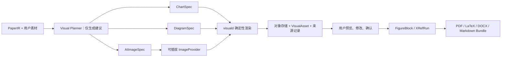

# PaperForge 图片与图表生成能力优化方案

## 1. 总结与落盘交付

- 本方案同步更新 `docs/design.md` 的 PaperIR、生成管线、渲染架构和 API 契约，并在
  `docs/roadmap.md` 新增 M8 里程碑。
- 当前系统已有 `FigureBlock` / `TableBlock`、素材上传和 `\\includegraphics` 路径预留，
  但缺少生成器、视觉资产生命周期、章节插入、二进制编译传输和完整导出，属于
  “接口预留但链路未闭合”。
- 首版交付三类能力：
  - 数据图表：从 CSV/XLSX 确定性生成柱状图、折线图、散点图、箱线图和热力图。
  - 学术示意图：从结构化节点/边生成流程图、系统架构图和方法框图。
  - AI 位图：仅生成概念性插图；实验结果、数据曲线和精确技术结构必须使用确定性图表/示意图。
- 采用“自动建议 + 人工确认”：全文写完后产生视觉建议，但不暂停原有 draft-first 管线、
  不自动发起付费文生图调用、不自动插入论文。
- AI 图在界面显示来源标识，导出工程附带 provenance 清单；caption 默认不强制追加“AI 生成”。



## 2. 核心架构与数据契约

### 2.1 视觉资产与来源

新增 `visual_asset`：

- `kind`：`chart | diagram | ai_image`。
- `generation_status`：`proposed | queued | running | ready | failed`。
- `review_status`：`pending | approved | rejected`。
- 标题、caption、alt text、目标章节、建议插入位置和不可变 figure label。
- `spec_json`、provider/model、错误信息、各格式 rendition、内容哈希、输入哈希、文档版本、创建时间。
- `version` 与 `supersedes_id`：重新生成创建新版本；旧版继续留在论文中，直到用户确认替换。

新增 `visual_source_asset`，保存图表与 `user_asset` 的真实依赖及源文件哈希，并启用删除保护；
存在依赖时删除原始数据返回 409，避免图表失去来源。

新增 `visual_generation_attempt`，记录 provider、model、请求 ID、耗时、输出尺寸、usage、
可选成本估算和错误码；失败调用同样留痕。

视觉文件按内容寻址保存：

```text
users/{user_id}/projects/{project_id}/visuals/{visual_id}/v{version}/{sha256}.{ext}
```

禁止原地覆盖。

### 2.2 结构化视觉规格

`ChartSpec` 只引用已解析的 `user_asset`，不接受任意代码、URL 或 LLM 直接提供的数据值。

- 支持 `bar / line / scatter / box / heatmap`。
- 明确指定 x、y、series、误差列、轴标签、单位、排序和图宽。
- 仅允许显式 filter、sort、mean/median/sum/count 聚合；禁止插值、补值和静默采样。
- 当前素材解析上限 500 行继续作为首版绘图上限。

`DiagramSpec` 使用节点、边、分组和 `TB/LR` 布局方向；最多 30 个节点、60 条边；
不接受原始 DOT/Mermaid、脚本或外部资源。

`AIImageSpec` 仅包含概念性 prompt、尺寸、质量和风格：

- 不允许绑定实验数据素材，不允许请求坐标轴、结果曲线、准确率图或精密装置图。
- 首版不上传论文数据或原始图片给图像厂商，只发送用户确认过的概念 prompt。

从旧 DeepSearch 复制并解耦其 FigureIR provenance、远程数据拒绝、SVG 转义和 trace 校验思想；
不直接 import 旧项目，不迁移面向 Report IR/PPTX 的 claim、slide 或硬编码 Transformer 图逻辑。

### 2.3 PaperIR 扩展

保留 `FigureBlock.asset_ref`，兼容现有 `ua_*` 上传图，并新增 `va_*` 生成图引用：

```json
{
  "type": "figure",
  "asset_ref": "va_...",
  "caption": "...",
  "alt_text": "...",
  "label": "fig:va_...",
  "width": "column|full"
}
```

新增 `XRefRun`：

```json
{"t": "xref", "target": "fig:va_...", "kind": "figure"}
```

LaTeX 渲染为稳定的 `\\ref`；Markdown/DOCX 根据 PaperIR 遍历顺序确定性生成
“图 1/Figure 1”。新增 `collect_asset_refs()` 和 label 唯一性检查；章节保存时由服务端重新计算
`asset_refs_json`，不信任客户端提交值。图表 caption 与 alt text 在批准前必须非空；label 由服务端
生成并保持不可变。

### 2.4 渲染服务与图像后端

新增隔离的 `visuald`：

- 无外网、资源限额、固定字体和版本。
- Matplotlib 负责统计图，Graphviz 负责布局，Pillow 负责位图校验和元数据清理。
- 输出 SVG、PDF 和 PNG；默认白底、色盲友好配色、中文字体、单栏/通栏论文尺寸和 300 DPI PNG。
- 仅接受已验证的结构化规格和内联数据，不执行 LLM 生成的 Python/DOT，不读取远程 URL。

新增 `ImageProvider.generate(ImageRequest) -> ImageResult` 协议及 provider registry/factory。默认适配器
使用 Cloudflare Workers AI，模型为 `@cf/black-forest-labs/flux-1-schnell`；OpenAI 适配器继续保留，
未来 GPT Image、Gemini 或本地 ComfyUI 只需实现统一协议并注册，不改 worker、VisualAsset 或导出链路。
所有图像厂商通过独立的 `IMAGE_PROVIDER / IMAGE_BASE_URL / IMAGE_API_KEY / IMAGE_MODEL` 配置；
Cloudflare 另用 `IMAGE_ACCOUNT_ID`，不复用当前文本模型配置。

Cloudflare 单 prompt 生图调用 `POST /client/v4/accounts/{account_id}/ai/run/{model_name}`，JSON/base64
或二进制图片输出均先校验 JPEG/PNG magic bytes，再交给 `visuald` 规范化并落库；鉴权、审核和参数
错误不重试，429/5xx/网络超时采用有界退避。占位配置不完整时不创建外部请求，只禁用 AI 生图入口。
接口与模型边界参见 [Workers AI REST API](https://developers.cloudflare.com/workers-ai/get-started/rest-api/)、
[Run a model](https://developers.cloudflare.com/api/resources/ai/methods/run/) 与
[FLUX.1-schnell](https://developers.cloudflare.com/workers-ai/models/flux-1-schnell)。

## 3. 生成流程、API、界面与导出

### 3.1 工作流

1. 全文 `write` 完成后增加 `visual_plan` 阶段，最多提出 6 个建议，其中 AI 位图最多 2 个。
2. 图表/示意图可自动生成无外部费用的预览；AI 位图只创建 proposal，用户点击“生成预览”后才调用 provider。
3. 用户修改规格、caption、alt text、目标章节和插入位置后批准。
4. 批准操作在一个事务中插入 `FigureBlock`、更新 `asset_refs_json` 和 review 状态；正文中的图引用通过编辑器“插入图引用”芯片单独放置。
5. 重新生成创建新 revision；旧图继续可导出，批准替换后才原子切换 `asset_ref`。
6. 未批准、生成失败或 provider 未配置均不阻断正文和导出，只产生可见告警。

### 3.2 REST 接口

- `POST /projects/{id}/visuals/suggest`：异步生成视觉建议。
- `GET /projects/{id}/visuals`：按 kind/status 列出建议、版本和 rendition。
- `POST /projects/{id}/visuals`：手动创建 ChartSpec、DiagramSpec 或 AIImageSpec。
- `PATCH /projects/{id}/visuals/{visual_id}`：修改尚未批准的规格和文案。
- `POST /projects/{id}/visuals/{visual_id}/generate`：异步渲染或调用 ImageProvider。
- `POST /projects/{id}/visuals/{visual_id}/approve`：指定章节和 block index 后插入 PaperIR。
- `POST /projects/{id}/visuals/{visual_id}/reject`：拒绝建议。
- `POST /projects/{id}/visuals/{visual_id}/regenerate`：创建下一版本。
- `GET /projects/{id}/visuals/{visual_id}/renditions/{format}`：安全预览/下载 SVG、PDF、PNG。

所有接口验证 project ownership、状态机、引用来源和规格边界；响应不返回密钥。

### 3.3 前端

- 素材中心增加“原始素材 / 图表与插图”两个页签，保留现有数据解析与 NUMLINT。
- 提供非代码化生成向导：
  - 图表：选数据表、图形类型、字段、单位、颜色和宽度。
  - 示意图：编辑节点、连线、分组和方向。
  - AI 插图：编辑概念 prompt、比例和质量，并显示外部生成与成本提示。
- 写作台增加“视觉建议”面板，支持预览、调整、批准、拒绝和重新生成。
- 将只读 `irBlock` 中的 figure 替换为专用 Figure NodeView，显示真实预览、caption、alt text、
  AI 标识和删除/替换入口；未知结构化块仍保持无损透传。
- 增加 Figure XRef 芯片，保存时与引用芯片一样结构化往返。
- 设置页仅展示图像 provider/model 和“密钥是否配置”；成本页增加图像调用、失败数、尺寸和可选成本估算。

### 3.4 导出闭环

- `LatexProject` 拆为 `text_files` 与 `binary_files`；texd `/compile` 新增 base64 二进制文件字段，
  并验证相对路径、扩展名、magic bytes、单文件和总大小。
- 编译修复轮次只允许修改章节文本，二进制图始终原样携带。
- PDF/LaTeX ZIP：确定性图优先使用 PDF 矢量版，AI 图使用规范化 PNG；ZIP 同时包含源规格和
  `visual-provenance.json`。
- DOCX：在 Pandoc 临时目录写入图片，使图片真正嵌入文档，而不是留下失效路径；作为 FigureBlock 使用的上传 PDF 先将首页确定性转换为 300 DPI PNG。
- 保留现有单文件 Markdown 兼容输出；新增 `markdown_bundle` ZIP，包含 Markdown、figures 目录和 provenance 清单。
- Markdown 预览使用受项目权限保护的 rendition URL，并正确渲染图片、caption、alt text和交叉引用。
- 该改造同时修复现有“上传图片有路径但二进制无法进入 texd”的历史缺口。

## 4. 实施阶段

### M8-A 基础闭环

- 落盘方案与设计/路线图。
- 数据迁移、仓储、VisualAsset API、PaperIR/XRefRun。
- `visuald` 骨架、对象存储、texd 二进制协议。
- 先让现有上传 PNG/JPEG/PDF 完整进入 PDF、LaTeX ZIP 和 DOCX。

### M8-B 确定性图表与示意图

- ChartSpec、DiagramSpec、来源校验、Matplotlib/Graphviz 渲染。
- 手动生成向导、预览、批准插入、交叉引用。
- SVG/PDF/PNG 和跨导出格式闭环。

### M8-C 自动建议与 AI 位图

- `visual_plan` 管线、结构化建议校验和确定性回退。
- ImageProvider 协议与注册表、Cloudflare FLUX 默认适配器、保留 OpenAI 适配器，以及审核/配额/重试处理。
- AI 标识、来源清单、版本化重新生成。

### M8-D 打磨与上线

- 成本面板、SSE 进度、失败恢复、浏览器/PDF 视觉 QA。
- `VISUALS_ENABLED` 与 `AI_IMAGES_ENABLED` 分级开关。
- 一键启动增加 visuald 健康检查；AI provider 未配置时仅禁用 AI 按钮，图表和示意图仍正常。

## 5. 测试与验收标准

- CSV/XLSX → 图表的每个绘图点都能追溯到源单元格；LLM 无法提交或改写数值。
- 缺列、非数值 y、远程 URL、任意 Python/DOT、静默采样和越权 asset ref 全部被拒绝。
- 图表聚合、过滤或截断必须写入 spec、caption 提示和 provenance。
- DiagramSpec 的重复节点、悬空边、超限节点/边和不安全文本有反例测试。
- ImageProvider 覆盖成功、超时、429、5xx、鉴权失败、审核拦截、非法 base64、伪造 MIME、
  超大图片；审核和鉴权错误不重试。
- 自动建议不得发起 AI 生图调用、不得改动 PaperIR、不得阻断原有全文管线。
- 批准操作验证 caption/alt、目标章节、block index、label 唯一性和项目隔离；重复批准幂等。
- `PaperIR → Tiptap → PaperIR` 对 FigureBlock/XRefRun 无损；章节编辑不再丢图。
- texd 覆盖二进制路径穿越、扩展名/magic 不符、损坏图片、总大小超限，以及每轮修复后图片仍存在。
- 端到端场景：
  - 上传 CSV → 生成图表 → 批准 → 正文图引用 → PDF、DOCX、LaTeX ZIP、Markdown Bundle 均含图。
  - 生成架构图并以矢量 PDF 进入双栏模板。
  - Cloudflare mock 契约必须通过；真实 Token 冒烟只在人工配置后显式执行，不作为占位配置验收前提。
  - visuald、ImageProvider 任一不可用时，正文和无图导出仍成功并显示降级原因。
  - 重新生成不会替换已批准旧图，直到用户确认新版。
- 视觉验收检查中文字体、图例、坐标轴、单栏/通栏尺寸、caption 编号、色盲配色、DOCX 嵌图和 PDF 清晰度。
- 性能默认：500 行以内确定性渲染 p95 小于 5 秒；单个规范化 rendition 不超过 16 MiB；
  一次 texd 编译最多 32 个图文件、64 MiB。
- 兼容性默认：不回填旧数据、不改变已有 `ua_*` FigureBlock；现有项目和纯文本导出保持可用。
